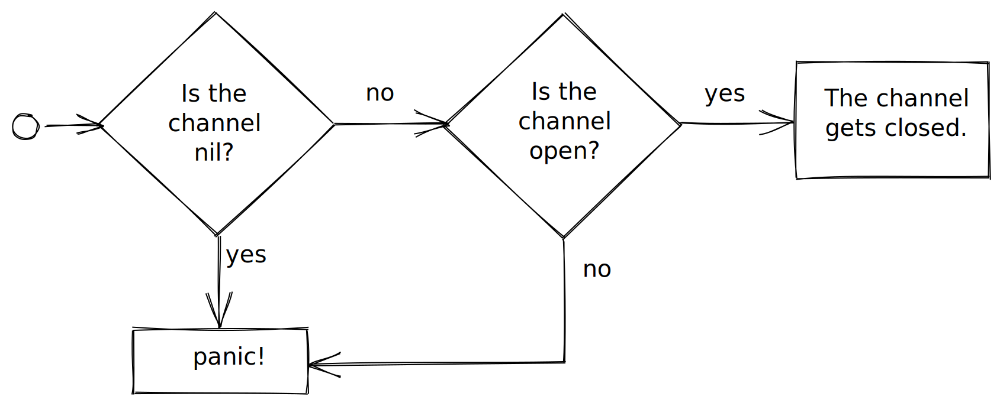
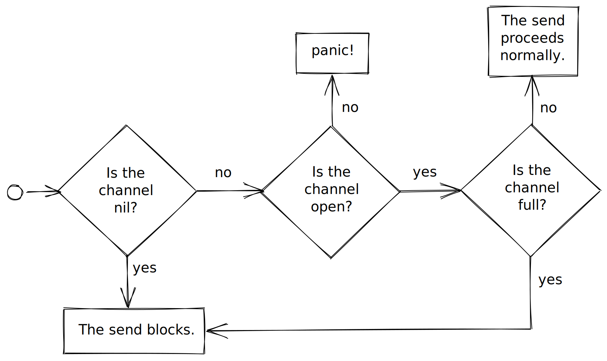
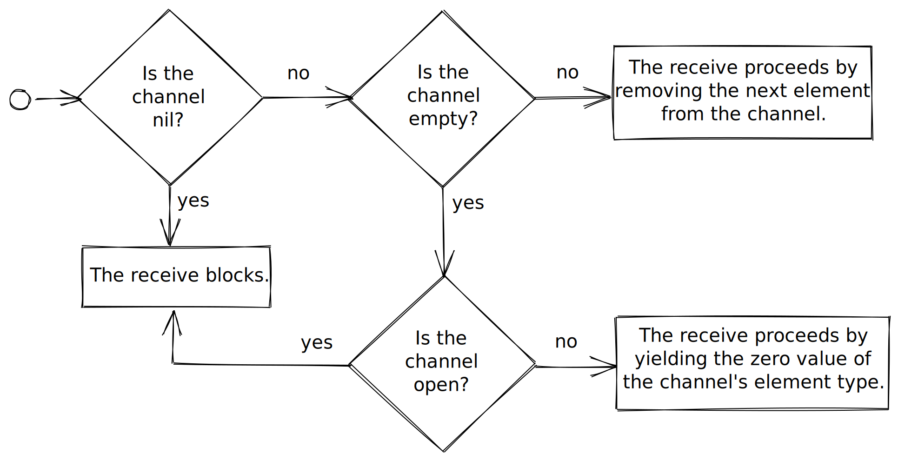

### Namecheck project: CLI username checker

* write an executable
```
namecheck
├── cmd
│   └── cli
│       └── main.go
...
```
* check validity and availability on each social network sequentially
* user experience?

---

# Concurrency

---

### Concurrency

* the art of composing a programme in terms of independenly executing computations
* arguably Go's most fascinating aspect
* very important in this era of multicores

---

### Concurrency is not parallelism

* a way of writing a program
* concurrent programme has value even if ultimately executed on a single core

---

### The origin of Go's concurrency

* Tony Hoare's _Communicating Sequential Processes_
* two fundamentals mechanisms:
  * goroutines
  * channels

---

### goroutines

* a concurrent function execution
* has no ID (unlike a Unix process)
* `main` function is itself a goroutine
* Go scheduler: in charge of switching between goroutines

---

### The `go` keyword

* used to spawn a new goroutine
* causes the following function call to be executed "in the background"
* similar to `&` in Unix shell
```go
go prepareSoufflé()
go peelPotatoes()
```

---

### `go` statements...

... immediately yield control back to the enclosing function.

---

### The `go`lden rule

Before launching a goroutine,
you must understand exactly under what conditions it will terminate.

(Otherwise, you risk _leaking_ goroutines.)

---

### Exercise

* Define two functions, `prepareSoufflé` and `peelPotatoes` that simply print
something to stdout.
* Call them concurrently in `main`.
* What happens? Why?

---

### Wait groups

* `main` does not wait for other goroutines to terminate before it itself terminates
* if tempted to use a sleep, step away from the keyboard and think again

---

###  Wait groups (cont'd)

* `sync.WaitGroup` can be used for
  * keeping track of the number of executing goroutines
  * waiting for that count to go down to 0

---

### Wait-group example

```go
func main() {
  var wg sync.WaitGroup // remark: usable zero value!
  wg.Add(1)             // one more goroutine created
  go func() {
    defer wg.Done()     // one done
    prepareSoufflé()
  }()
  wg.Add(1)             // one more goroutine created
  go func() {
    defer wg.Done()     // one done
    peelPotatoes()
  }()
  wg.Wait()             // ... for all goroutines to be done
}
```

---

### Gotcha: never call `Add` after `Wait`

> calls [to `Add`] with a positive delta that occur when the counter is zero
> must happen before a `Wait`.

(see [documentation](https://golang.org/pkg/sync/#WaitGroup.Add))

---

### Gotcha: goroutine & func

```go
func printTenIntsConcurrently() {
  var wg sync.WaitGroup
  const n = 10
  wg.Add(n)
  for i := 0; i < n; i++ {
    go func() {
      defer wg.Done()
      fmt.Println(i)
    }()
  }
  wg.Wait()
}
```

* Do you get the output you expect?
* Why / why not?

---

### Gotcha: goroutine & func

```go
func printTenIntsConcurrently() {
  var wg sync.WaitGroup
  const n = 10
  wg.Add(n)
  for i := 0; i < n; i++ {
    go func() { // this function "closes over" loop variable i
      defer wg.Done()
      fmt.Println(i) // but i is being modified concurrently
    }()
  }
  wg.Wait()
}
```

* race condition!

---

### Gotcha: goroutine & func

* `go vet` warns you about the capture of the loop variable
* also, try running the programme with `-race`

---

### Gotcha: goroutine & func

```go
func printTenIntsConcurrently() {
  var wg sync.WaitGroup
  const n = 10
  wg.Add(n)
  for i := 0; i < n; i++ {
    go func(j int) {  // <----
      defer wg.Done()
      fmt.Println(j)
    }(i)              // <----
  }
  wg.Wait()
}
```

* see [the Golang FAQ](https://golang.org/doc/faq#closures_and_goroutines)

---

### Gotcha: goroutine & func

* if possible, avoid using func literals with `go`
* instead, define a dedicated function

```go
func printTenIntsConcurrently() {
  var wg sync.WaitGroup
  const n = 10
  wg.Add(n)
  for i := 0; i < n; i++ {
    go printConcurrently(i, &wg)
  }
  wg.Wait()
}
func printConcurrently(i int, wg *sync.WaitGroup) {
  defer wg.Done()
  fmt.Println(i)
}
```

---

### Namecheck project: add concurrency

* Rather than sending requests sequentially, send them concurrently.
* Does user experience improve?

---

## Channels

---

### Share memory by communicating

* _Do not communicate by sharing memory; instead, share memory by communicating._
* channel: mechanism for passing values of a certain type from one goroutine to another

---

### Channel type

* a channel of `T`s has type `chan T`
* the element type can be arbitrary
* channel of channels possible:

```go
var chandler chan chan man
```

---

### Channel: naming conventions

* "ch" (alone or as suffix) or "c" suffix
* example:
```go
var errc chan error
```
* plural of element type:
```go
var tasks chan task
```

---

### Channels are reference types

* reference type
* zero value: `nil`

---

### Initializing channels

* `ch := make(chan T, c)`
* `c`: optional capacity (defaults to zero)

---

### Channel capacity

* a channel has
  * a length: `len(ch)` (seldom used)
  * a capacity: `cap(ch)`

---

### Channel capacity (cont'd)

* a channel of
  * zero capacity is called an _unbuffered channel_
  * positive capacity is called a _buffered channel_

---

### Channel capacity: metaphor


---

## Operations on a channel

* sending a value to channel
* receiving a value from a channel
* ranging over a channel
* closing a channel

---

### Closing a channel

* a (non-`nil`) channel starts its life as open
* a channel can be closed: `close(ch)`
* a closed channel cannot be re-opened
* useful operation when ranging over a channel

---

### Close semantics



---

### Closing doesn't drain the channel

* closing a channel does not drain it from the elements it contains
* restaurant metaphor: end of service doesn't mean pushing all the patrons out!

---

### Channels are not resources

* only close them if the program requires it
* otherwise, simply let them get GC'd

---

### Sending to a channel

* sending value `v` to channel `ch`:
```
ch <- v
```

---

### Send semantics



---

### Receiving from a channel

* receiving a value from channel `ch`:
```
<-ch
```
* to store the received value in a variable:
```
v := <-ch
```

---

### Receive semantics



---

### Dispelling the ambiguity

```go
v, ok := <-ch
```

* `ok` is
  * true if `ch` was still open at the time of receiving `v` from it
  * false if `ch` is closed

---

### Ranging over a channel

* receiving from a channel in a loop
```go
for v := range ch {
  // do something with v
}
```
* loop only terminates once channel is closed

---

### Ranging over a channel (cont'd)

* equivalent to

```go
for {
  v, ok := <-ch
  if !ok {
    break
  }
  // do something with v
}
```

---

### Namecheck project: define a Result type

(in the `main` package)

```go
type Result struct {
  Username string
  Platform string
  Valid bool
  Available bool
  Error error
}
```
---

### Namecheck project: use channels

* in `main`, create a channel of `Result`
* at the end of each goroutine
  * create a `Result` value
  * send it to the channel
* in `main`, range over that channel in `main`
  and aggregate the results (e.g. in a slice)

---

### Directional channels

* send-only channel of `T`s has type
```
chan<- T
```
* receive-only channel if `T`s has type
```
<-chan T
```
* assignability: see https://play.golang.org/p/aRdNg3B7z6J

---

### Directional channels (cont'd)

* useful to what can be done with a channel
* the compiler disallows
  * receiving from a send-only channel
  * sending to a receive-only channel
  * closing a receive-only channel

---

### `select` construct

```
select {
case v := <-ch1:
  // do something with v
case ch2 <- 42:
  // ...
default:
  // ...
}
```

* analogous to a switch but for concurrency
* each normal case is a channel send or receive

---

### `select` construct (cont'd)

```
select {
case v := <-ch1:
  // do something with v
case ch2 <- 42:
  // ...
default:
  // ...
}
```

* the default case is optional
* the first normal case that doesn't block gets executed
* if none of the normal cases are ready, the default case (if any) gets executed

---

### Event loop

`select` is often used within a loop:

```
for {
  select {
  case ...:
    // ...
  case ...:
    // ...
  default:
    // ...
  }
}
```

---

### `chan struct{}`

```go
quit := make(chan struct{})
```
* can be useful for signaling that some unambiguous event took place!
* in one goroutine
```go
<-quit
```
* in another goroutine:
```go
close(quit) // or quit <- struct{}{}
```

---

### Exercise (in playground)

* write a function
```go
func cancellablePrint(quit chan struct{})
```
* it should print incrementing integers every 200ms
* it should terminates when the channel is closed
* solution: https://play.golang.org/p/mQ8wCiKdNde

---

### `context` package

* for cancellation and timeouts
* uses a `<-chan struct{}` to broadcast a cancellation signal to multiple goroutines
* more on this in the second training

---

### Example: ping pong

* https://play.golang.org/p/0tN8oMLyN1W
* Can you spot the bug?
* How would you fix it?

---

### Example: ping pong (fixed?)

* use a `chan struct{}` to signal termination
* https://play.golang.org/p/ay-LBADdP9v
* one goroutine may still leak... where?

---

### Example: ping pong (fixed!)

* https://play.golang.org/p/0xfHum4NzzS

---

### Namecheck project: fail early

* report normal results and errors in separate channels
* use `select` to receive from both channels
* terminate the programme as soon as an error is received

---

### Concurrency patterns

* we're only scratching the surface of what's possible
* many, many different possibilities with goroutines and channels
* to get an idea, watch
  * [Dave Cheney - Concurrency made easy (GopherCon SG 2017)](https://www.youtube.com/watch?v=yKQOunhhf4A)
  * [Go Concurrency Patterns (Rob Pike, Google I/O 2012)](https://www.youtube.com/watch?v=f6kdp27TYZs)

---

### Namecheck project: turn your CLI tool into a server

Create another `main.go` under `cmd/server`

```
namecheck
├── cmd
│   ├── cli
│   │   └── main.go
│   └── server
│       └── main.go
```
---

### Namecheck project: turn your CLI tool into a server

* Start from https://golang.org/pkg/net/http/#example_ListenAndServe
* Adapt the code from the CLI executable to your server
* Use `/check` endpoint
* Optional: return a proper JSON response
* see https://golang.org/pkg/encoding/json/

---

### Namecheck project: modules and vendoring

* Now use 3rd-party dependency gorilla/mux for routing
* run the following at the root of the project
```go
go mod vendor
```
* a `vendor` directory is created and contains a copy of your dependencies
* you can track that directory with your VCS for reproducible, network-free builds

---

### Namecheck project: request timeouts

* add query param `simulateLatency=1` to Twitter endpoint
* one requests out of five becomes slow
* use a custom client with a timeout of 3 seconds
* see https://golang.org/pkg/net/http/#Client

---

### Communicating by sharing memory

* pros: more efficient, sometimes simpler
* two alternatives to channels
  * atomics
  * mutexes

---

### Namecheck project: number of visits

* keep a count of the number of requests served

---

### Atomics

* synchronized operations on fixed-sized integers
* see `sync/atomic` package

---

### Namecheck project: count of checks per username

* keep track (in memory) of how many times a given username has been checked
* ... we need some kind of dictionary or associative array...

---

## Maps

---

### Maps

* collection of key-value pairs
* a map of `K`s to `V`s has type `map[K]V`
* the key type must be comparable
* implemented as a hash table

---

### Maps are reference types

* zero value: `nil`
* accessing elements of a nil map: zero value of value type
* attempting to add an entry to a nil map => panic!

---

### Maps are reference types (cont'd)

* a function that takes a map argument gets a copy of the reference
* the underlying hash table does not get copied

---

### Initializing a map

```go
m := make(map[string]int)
```

---

### Map literals

```go
enToFr := map[string]string {
  "one": "un",
  "two": "deux",
  "three": "trois", // mandatory comma
}
```

---

### Accessing the elements of a map

* `v := m[k]`
* key `k` needs not be in the map
* ... in which case `v` will be the zero value for the value type!

---

### Testing for membership

```go
v := m[k] // then test that v is not the zero value?
```

---

### Testing for membership

```go
v := m[k] // ambiguous!

// solution
v, ok := m[k]
if ok {
  // the key is present
}
```

---

### Ranging over a map

```go
for k, v := range m {
  // do something with k and v
}
```
* iteration order is nondeterministic!

---

### Ranging over a map in a deterministic order

```go
// create a slice of keys
keys := make([]string, 0, len(m))
for k := range m {
  keys = append(keys, k)
}

// sort it
sort.Strings(keys)

// then range over the sorted slice of keys
for k := range keys {
  // do something with k and m[k]
}
```

---

### Sets

* No native set type in Go!
* Usually implement as `map[T]bool`
* ... or `map[T]struct{}`

---

### Namecheck project: count of checks per username

* keep track (in memory) of how many times a given username has been checked
* use a `map[string]uint`
* any issue?

---

### Mutexes

* "mutual exclusion"
* allows you to acquire/release a lock on a variable
* see `sync` package
* cons (compared to channels)
  * less composable
  * more dangerous (deadlock)
  * encourages global state

---

### Namecheck project: count of checks per username

* keep track (in memory) of how many times a given username has been checked
* use a `map[string]uint`
* use a `sync.Mutex` to prevent data races

---

### What we haven't covered

https://www.humancoders.com/formations/go-avance

---

# Learning resources

---

### Books

* Kernighan & Donovan - The Go Programming Language
* Brian Ketelsen & Erik St. Martin - Go in Action
* Matt Ryer - Go Programming Blueprints (2nd ed.)

---

### Blogs

* Official Golang blog: https://blog.golang.org
* Dave Cheney: https://dave.cheney.net
* JBD/Rakyll: https://rakyll.org
* Jack Lindamood: https://medium.com/@cep21
* jub0bs.com (shameless plug)

---

### Talks

* Anything by Rob Pike, Dave Cheney, Sameer Ajmani, or Matt Ryer
* Marcus Olsson - Building an enterprise service in Go (Golang UK Conference 2016)
* Dave Cheney - Concurrency made easy (GopherCon SG 2017)

---

### Vidcasts

* Francesc Campoy Youtube channel (JustForFunc)

---

### Video courses

* William Kennedy - Ultimate Go v2 (O'Reilly 2018)
* John Graham-Cumming - Introduction to Go Programming (O'Reilly 2014)
* Mike van Sickle's Pluralsight courses

---

### Podcasts

* Go Time: https://changelog.com/gotime

---

# Thank you!
